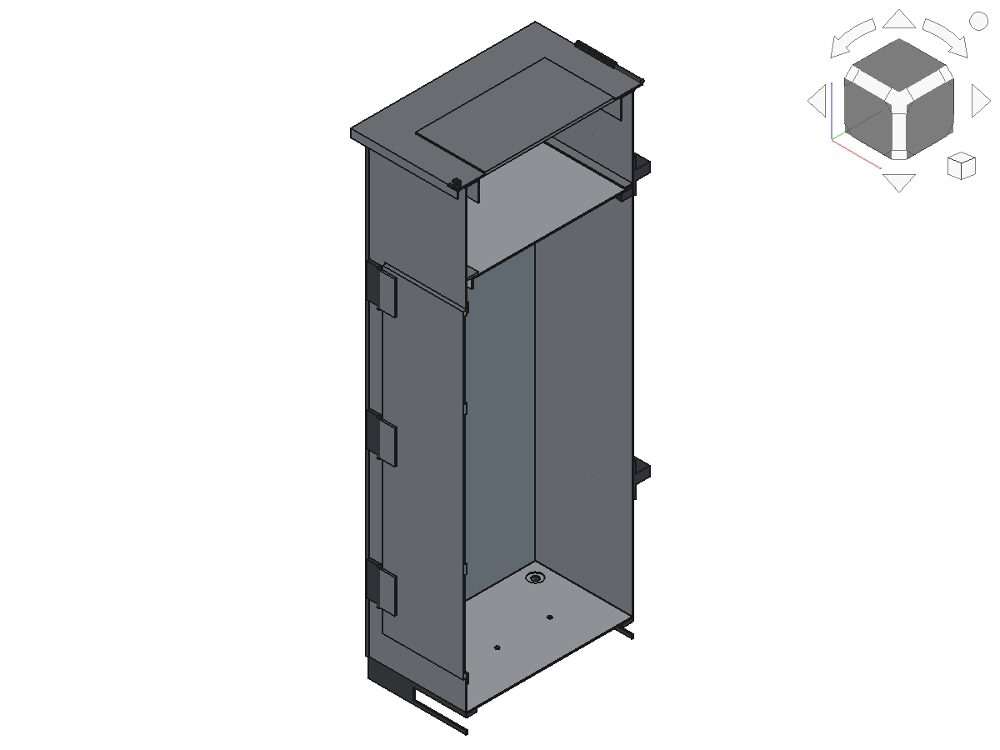
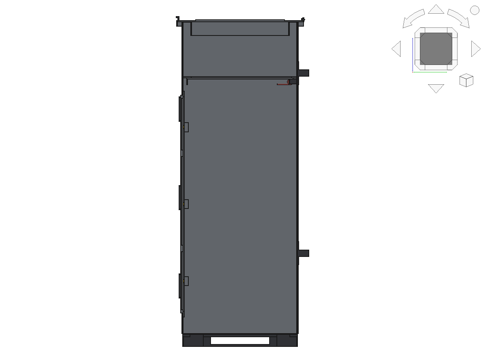
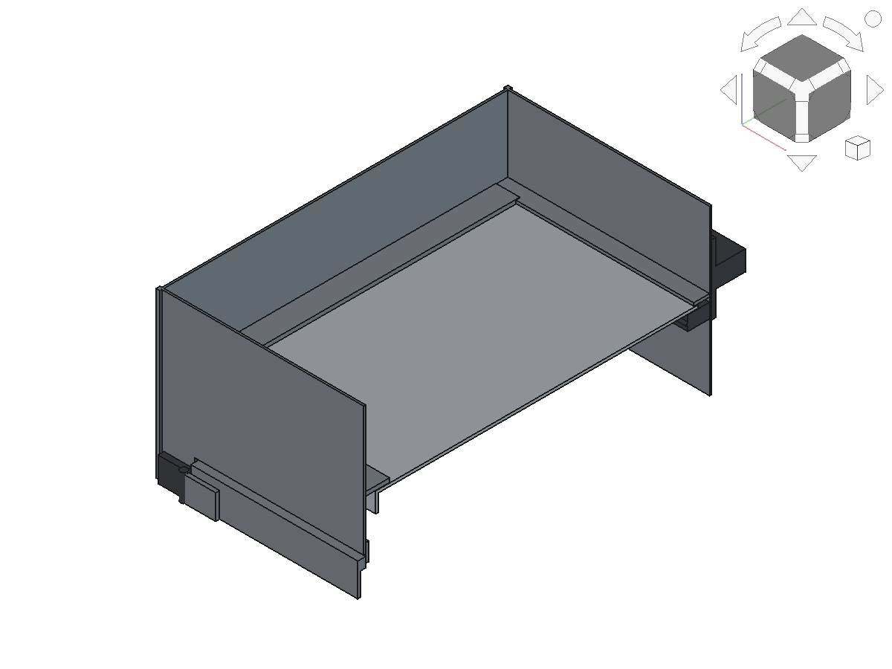
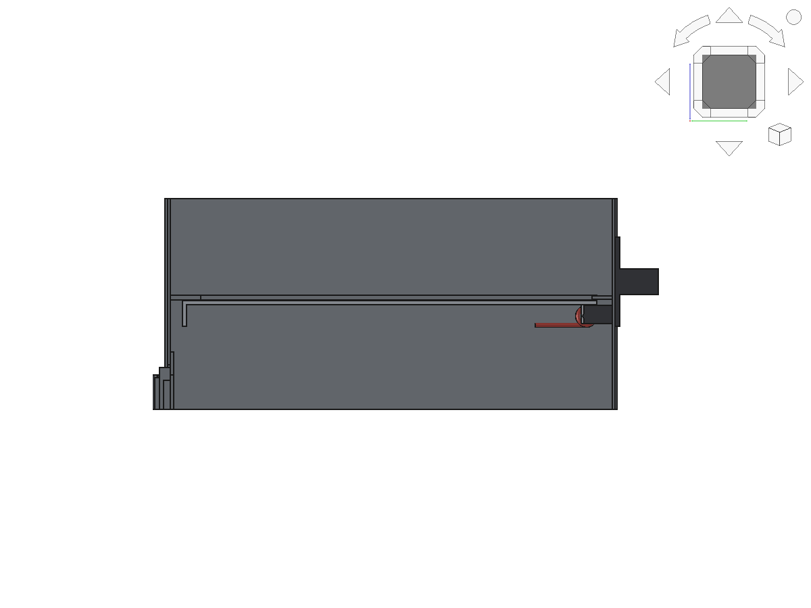
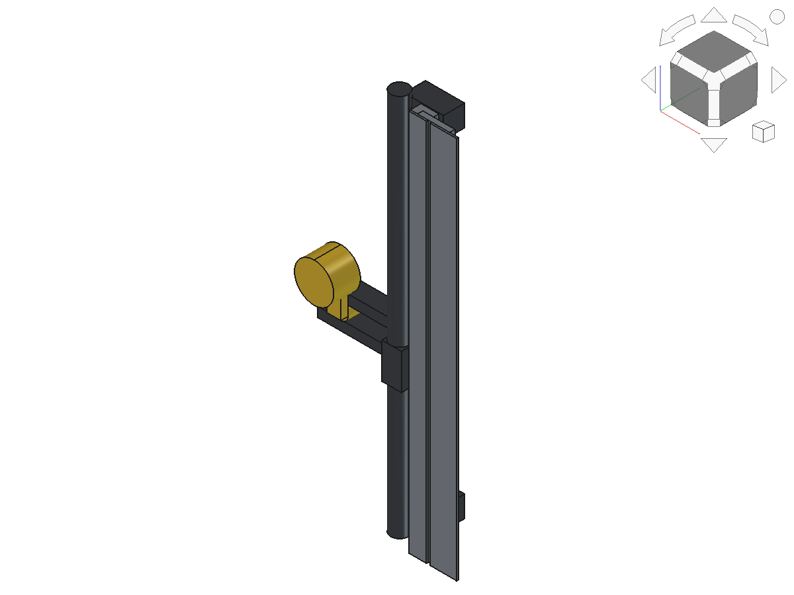

# Parcel Drop Box — Secure Courier Delivery Box

A sheet-metal parcel box in the style of the 3FlexHome "Large Parcel Drop
Box — Top Access", designed so that **what goes in cannot come back out**
except through the owner's locked door.

- **Hinged top flap (top access)** — couriers drop parcels in from above.
- **One-way anti-fishing trap** — a spring-returned plate 170 mm below the
  rim that rotates downward only.
- **Concealed 4-point cam lock** on the front retrieval door — no hasp, no
  shackle, nothing to cut.
- **Anti-pry, anti-lift, anchorable** — inset door in a rebated frame, dog
  bolts on the hinge edge, welded floor, four M12 ground anchors and two
  wall brackets.

Built parametrically in [FreeCAD](https://www.freecad.org).
Russian version with a detailed walk-through of the mechanisms:
[README.ru.md](README.ru.md).

## How the protection works

| Attack | Countermeasure |
|--------|----------------|
| Reaching in through the drop flap | `TrapDoor` closes the throat 170 mm down; parcels then sit a further 780 mm below it, out of arm's reach |
| Fishing a parcel back out with a hook, wire loop or sticky tape | The trap is a **one-way** valve: `TrapStops` block it from ever rotating above horizontal, so it can be pushed down but never pulled up. Anything lifted against it only jams it harder shut |
| Prying the top flap | 18 mm overhang + 14 mm return skirt on three sides, and the `ThroatCollar` turns the rim into a closed box section with no exposed edge |
| Bending the flap back for a straight shot into the box | Stop tabs on `FlapHinge` limit the swing to ~85° |
| Cutting a padlock | There is none. `CamLock` is a concealed cylinder in the door face; a quarter turn lifts `LockBar`, whose four lugs slide in behind the frame keeps |
| Prying the retrieval door | The door is an **inset pan** in a rebated frame (`DoorFrame`): a 2 mm gap, a 10 mm return on every edge, and an 18 mm flange behind it. Nothing to hook a bar behind, and it cannot be pushed in |
| Grinding the door hinges off | Three `DogBolts` on the hinge edge stay engaged in keeps in the frame — removing the hinges does not free the door |
| Levering the box up off its base | The floor is a welded 3 mm plate, not a panel — there is no seam underneath |
| Carrying the whole box away | Four M12 ground-anchor bosses under the floor, reachable only with the door open, plus two `WallBrackets` for bolting to a wall or post |
| Rain and standing water | Flap overhang, collar return, four floor drains, open-bottomed plinth |

## Dimensions

| Parameter | Value |
|-----------|-------|
| Outer width × depth | 410 × 350 mm (414 × 354 over the corner ribs) |
| Overall height | 998 mm (40 plinth + 950 body + flap) |
| Clear drop opening | 356 × 296 mm |
| Trap plane | 170 mm below the rim |
| Parcel chamber | 406 × 344 × 780 mm |
| Retrieval door opening | 340 × 670 mm, sill 60 mm above the floor |
| Wall / flap sheet | 2 mm steel |
| Plinth, floor, door, trap sheet | 3 mm steel |
| Mass (steel only) | ≈ 52 kg |

## Parts

| Part | Role |
|------|------|
| `Plinth` | 40 mm perimeter base: feet, floor support ledge, four anchor bosses |
| `Floor` | Welded 3 mm floor plate, 4 drains, 4 recessed anchor holes |
| `Body` | 4 walls + corner ribs, open top, door opening in the front wall |
| `DoorFrame` | Rebate frame behind the opening + four lock keeps + three dog-bolt keeps |
| `WallBrackets` | Two slotted brackets for bolting the box to a wall or post |
| `ThroatCollar` | 25 mm inward flange + 40 mm return at the rim (stiffener / anti-pry) |
| `TopFlap` | Courier drop flap, 18 mm rain overhang, anti-pry skirt |
| `FlapHinge` | Rear piano hinge with stop tabs (~85° swing limit) |
| `FlapLatch` | Front drop latch |
| **`TrapDoor`** | **One-way anti-fishing trap, cranked rear hinge** |
| `TrapHinge` | Trap pin and fixed leaves, interleaved with the trap knuckles |
| `TrapSprings` | Two torsion springs that return the trap to closed |
| `TrapStops` | Ledges on three walls + rear cover: the trap can never rise above horizontal |
| `FrontDoor` | Inset retrieval door: pan, stiffener ribs, hinge leaves, handle |
| `DoorHinges` | Three wall leaves and pins |
| `DogBolts` | Three anti-lift pins on the hinge edge |
| `LockBar` | Vertical bar with four lugs and the cam yoke — the locking element |
| `CamLock` | Concealed cylinder; a quarter turn lifts the bar 22 mm |

## Drawings

Dimensioned sheets, generated from the same model by `drawings.py`:

| Sheet | |
|-------|-|
| [01 General arrangement](drawings/01_general_arrangement.svg) | front / right / plan, overall sizes |
| [02 Trap mechanism](drawings/02_trap_mechanism.svg) | sections B-B and C-C, swing envelope, spring notes |
| [03 Lock mechanism](drawings/03_lock_mechanism.svg) | door from inside, keep section D-D, cam section E-E |

## Files

- `cad/ParcelDropBox.FCStd` — FreeCAD document, closed / armed
- `cad/ParcelDropBoxOpen.FCStd` — flap back, trap tripped, door swung open
- `cad/ParcelDropBox.step` — STEP export of all 18 parts
- `cad/verify.txt` — solid validity, interference and mass report, both states
- `drawings/*.svg` — dimensioned drawings
- `build_box.py` — parametric FreeCAD script (all states)
- `drawings.py` — generates the drawing sheets
- `render.py` — regenerates `images/`
- `images/` — rendered views

## Views

Closed:

| Isometric | Front | Bottom | Right |
|-----------|-------|--------|-------|
|  |  |  |  |

Section on the X mid-plane — trap, springs, frame keeps and lock bar:

| Isometric | Side |
|-----------|------|
|  |  |

Mechanism close-ups — the one-way trap and the four-point lock:

| Trap, cut away | Trap, side | Lock, behind the door skin |
|----------------|------------|----------------------------|
|  |  |  |

Open — flap back, trap pushed open by a parcel, retrieval door swung wide:

| Isometric | Front | Back |
|-----------|-------|------|
|  |  |  |

## Regenerate

```sh
FreeCADCmd build_box.py                     # geometry, STEP and verify.txt
FreeCADCmd drawings.py                      # dimensioned sheets in drawings/

# images (headless); keep stdin open, FreeCAD's console quits on EOF
sleep 400 | LIBGL_ALWAYS_SOFTWARE=1 \
    xvfb-run -a -s "-screen 0 1600x1200x24" FreeCAD -c render.py
```

On a desktop, `FreeCAD -c render.py` is enough. Both scripts write next to
themselves, into `cad/` and `images/`; `render.py` builds the geometry in
memory and does not touch `cad/`.

## Design and build notes

- **Trap spring tuning is the one adjustment that matters.** The trap is a
  3 mm plate of about 2.3 kg hinged at the rear, so gravity alone would
  leave it hanging open. The two torsion springs must hold it shut and
  still yield to a light parcel; anchor the reaction leg on a slotted
  bracket so the preload can be set on assembly. Aim for a trap that a
  500 g parcel opens.
- The trap hinge is **cranked** — the pin sits 12 mm below the plate — so
  the plate clears its own stop ledges as it swings and cannot be levered
  off the pin from above.
- The trap knuckles and the fixed hinge leaves **interleave** along the
  pin like a piano hinge; weld the pin ends over so it cannot be driven
  out from the throat.
- Weld the `TrapStops` ledges continuously, not in tacks: they are what
  turns the trap from a flap into a one-way valve.
- The lock bar is thrown **upward** to lock. Each lug then sits behind a
  keep on the frame; with the bar down the lugs pass clear, so the door
  closes without forcing anything.
- The 60 mm sill under the door opening keeps parcels from tumbling out
  when the door is opened on a full box.
- Ground anchors go in first: the M12 bosses are only reachable through
  the open door, which is also why they cannot be undone from outside.
- All 18 solids are verified valid in both states with no unintended
  interference; the only overlaps are hinge pins inside their knuckles and
  welded joints (see `cad/verify.txt`).

## What this does not stop

An angle grinder, a battery reciprocating saw, or a vehicle and a chain
will get through any 2–3 mm sheet-steel box, this one included. The design
targets the realistic threat — an opportunist reaching or fishing through
the delivery opening, levering the doors, or walking off with the whole
box — and makes those attacks fail. Anchor it, and site it where a noisy
attack is not private.
