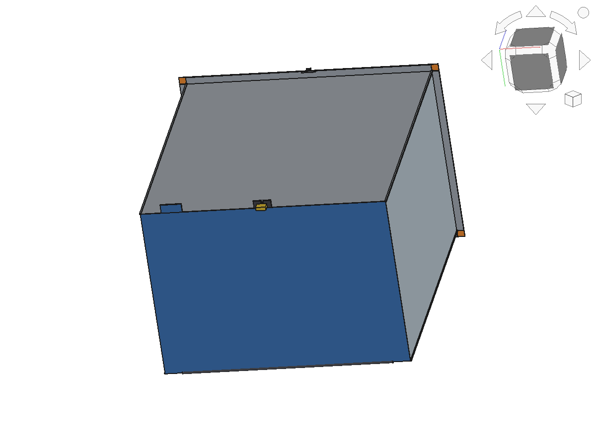
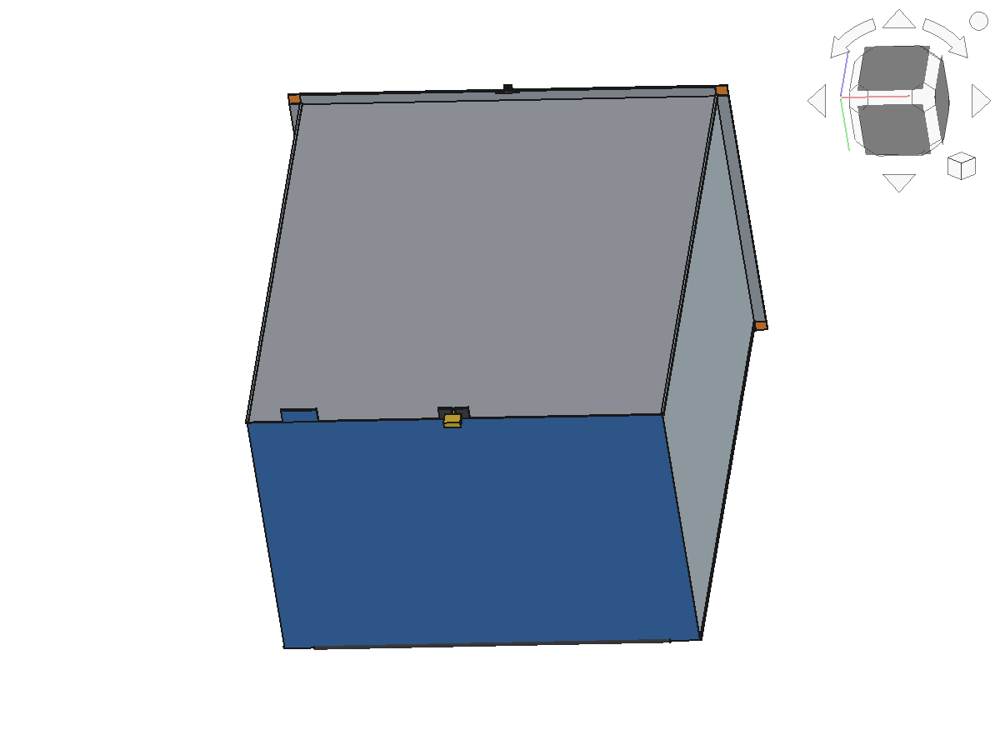
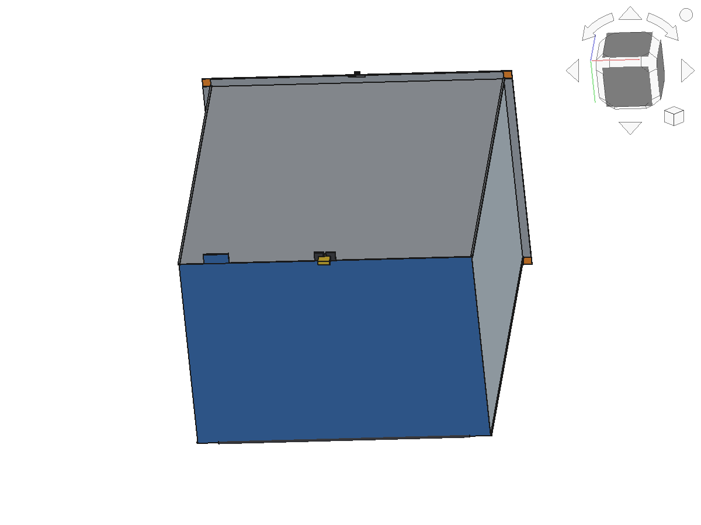
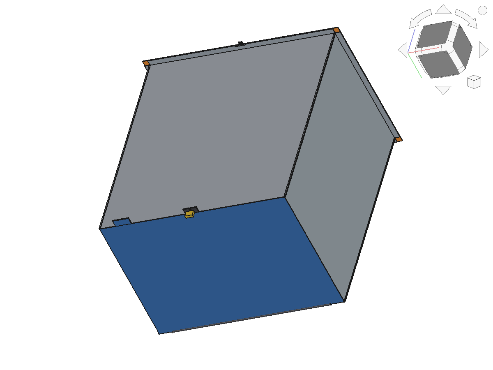
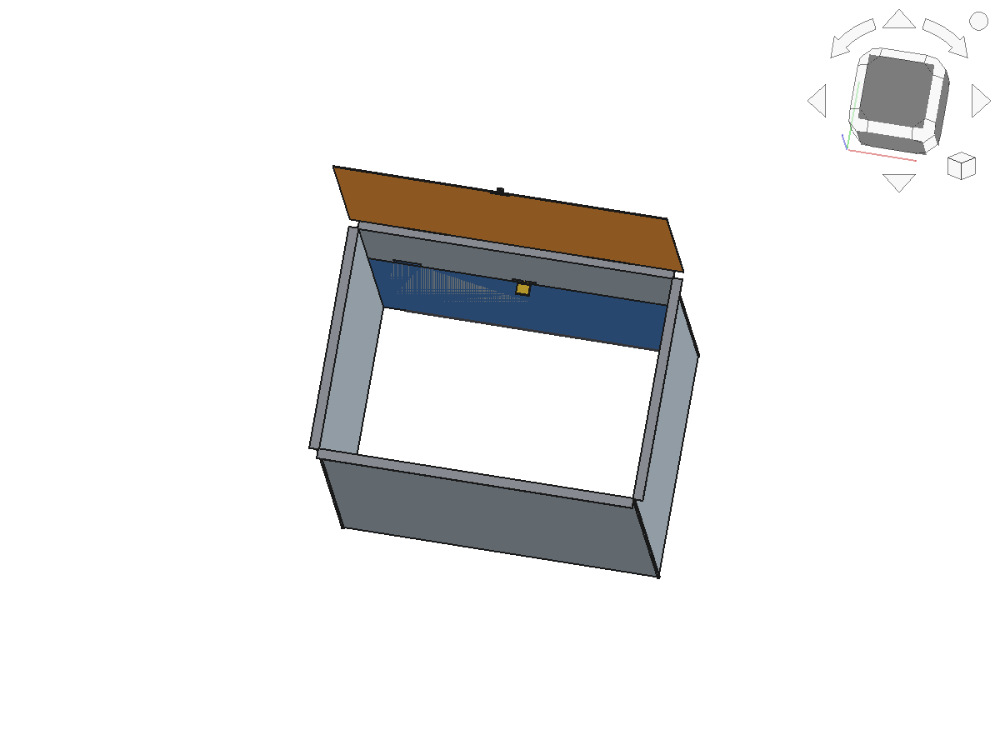
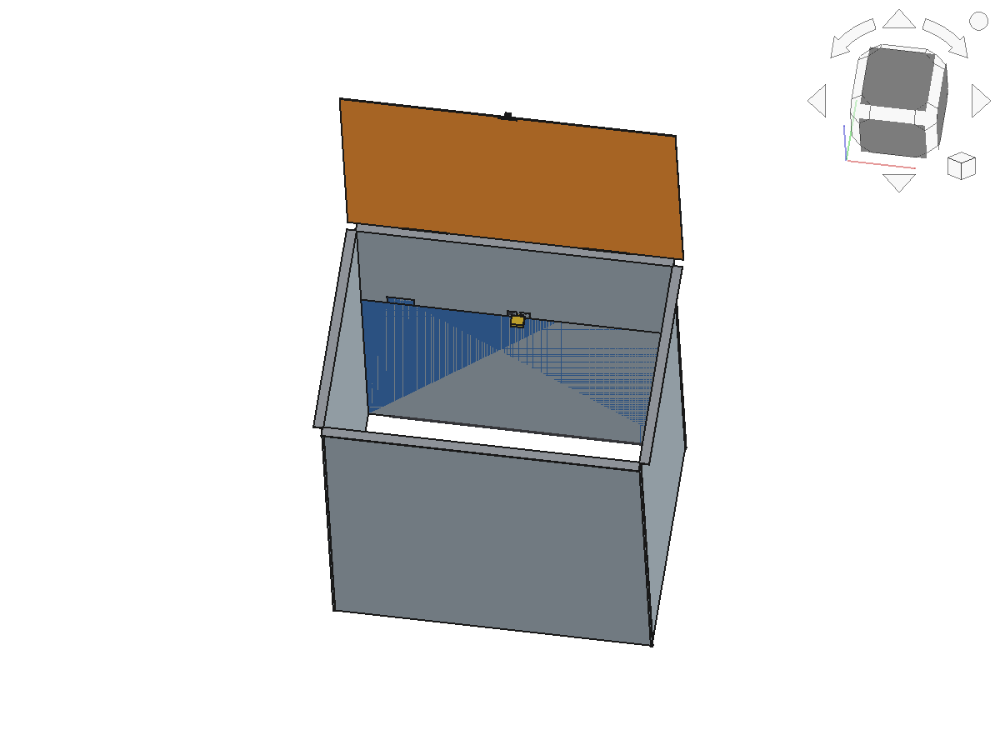
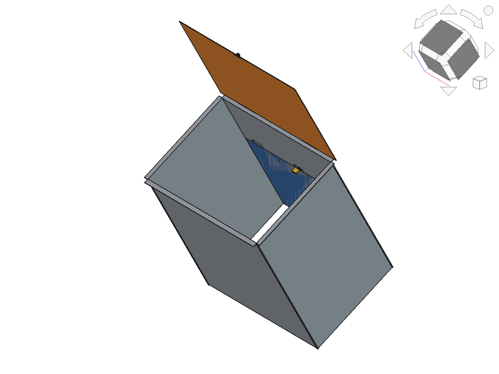

# Delivery Box — Sheet-Metal Courier Drop Box

A sheet-metal box for delivery couriers:

- **Open top** — couriers drop packages/boxes in from above.
- **Lockable bottom door** — the owner retrieves packages through a
  rear-hinged bottom door secured with a hasp + padlock.

Built parametrically in [FreeCAD](https://www.freecad.org).

## Dimensions

| Parameter | Value |
|-----------|-------|
| Outer width (X) | 700 mm |
| Outer depth (Y) | 500 mm |
| Outer height (Z) | 800 mm |
| Sheet thickness | 2 mm |
| Top flange overhang | 20 mm (all four sides) |

## Parts

| Part | Role |
|------|------|
| `Body` | 4 walls + top flanges + corner ribs (open top) |
| `TopLid` | Rain-cover lid, hinged on the rear edge |
| `LidHinge` / `LidLatch` | Lid hinge knuckles + front latch |
| `BottomDoor` | Full bottom panel, hinged on the rear edge, pull tab on the front edge |
| `DoorHinge` | Bottom-door hinge (rear edge) |
| `Hasp` | Lock bracket on the front bottom edge |
| `Padlock` | Padlock that secures the bottom door |

## Files

- `cad/DeliveryBox.FCStd` — FreeCAD document, closed state
- `cad/DeliveryBox.step` — STEP export of all 8 parts
- `build_box.py` — parametric FreeCAD script (regenerates both states)
- `images/` — rendered views (closed + open)

## Views

Closed:

| Isometric | Front | Bottom | Right |
|-----------|-------|--------|-------|
|  |  |  |  |

Open (bottom door + lid swung up):

| Isometric | Front | Back |
|-----------|-------|------|
|  |  |  |

## Regenerate

Run `build_box.py` inside FreeCAD (GUI Python console, or
`freecadcmd build_box.py`). It creates the `DeliveryBox` (closed) and
`DeliveryBoxOpen` (door + lid open) documents and exports the STEP file.

## Design notes

- Top is fully open for drop-in; the `TopLid` is a separate rain cover
  that can be removed or left open.
- The bottom door hinges on the **rear** edge and lifts up ~90°, so the
  hasp/padlock on the **front** edge stays clear while the door is open.
- All solids verified: valid geometry, zero interference between parts,
  open top confirmed, bottom fully sealed by the door.
