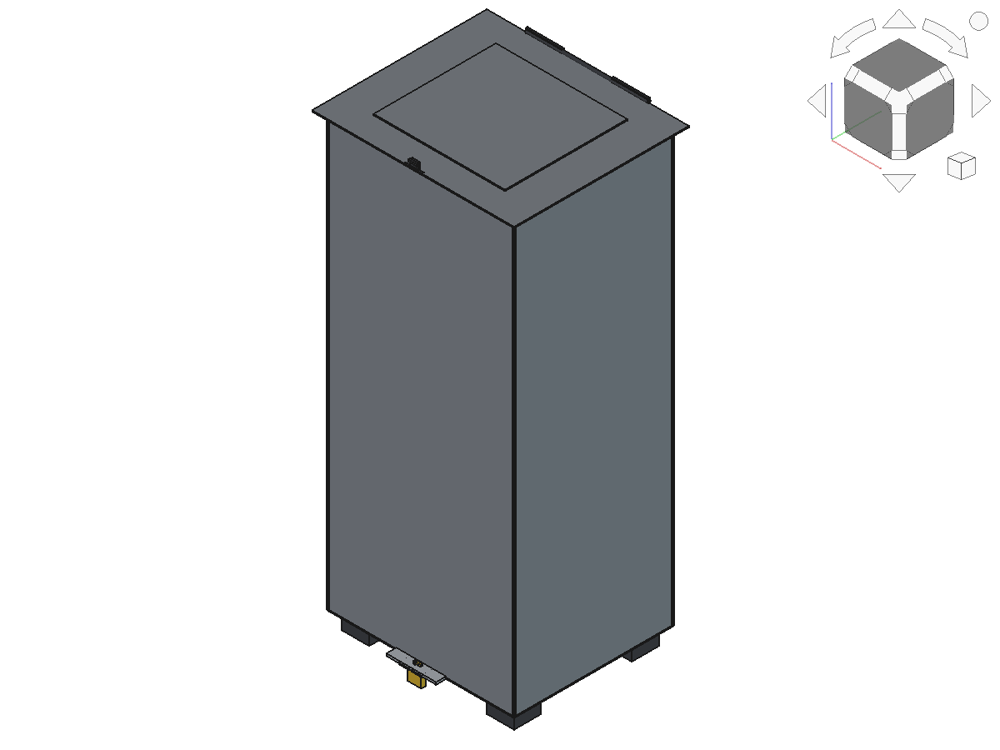
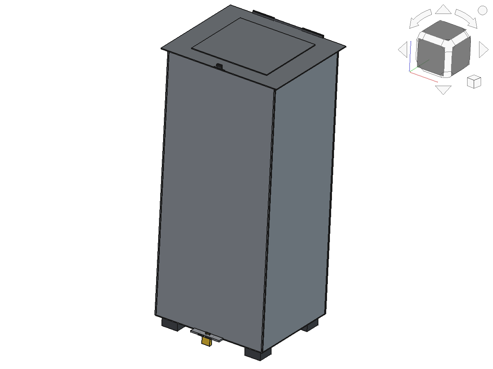
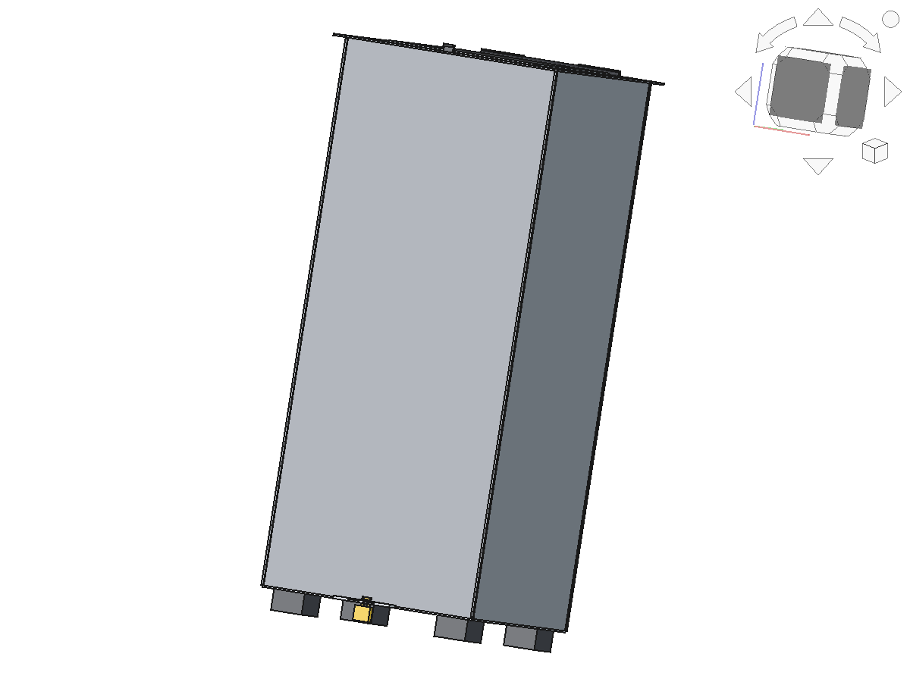
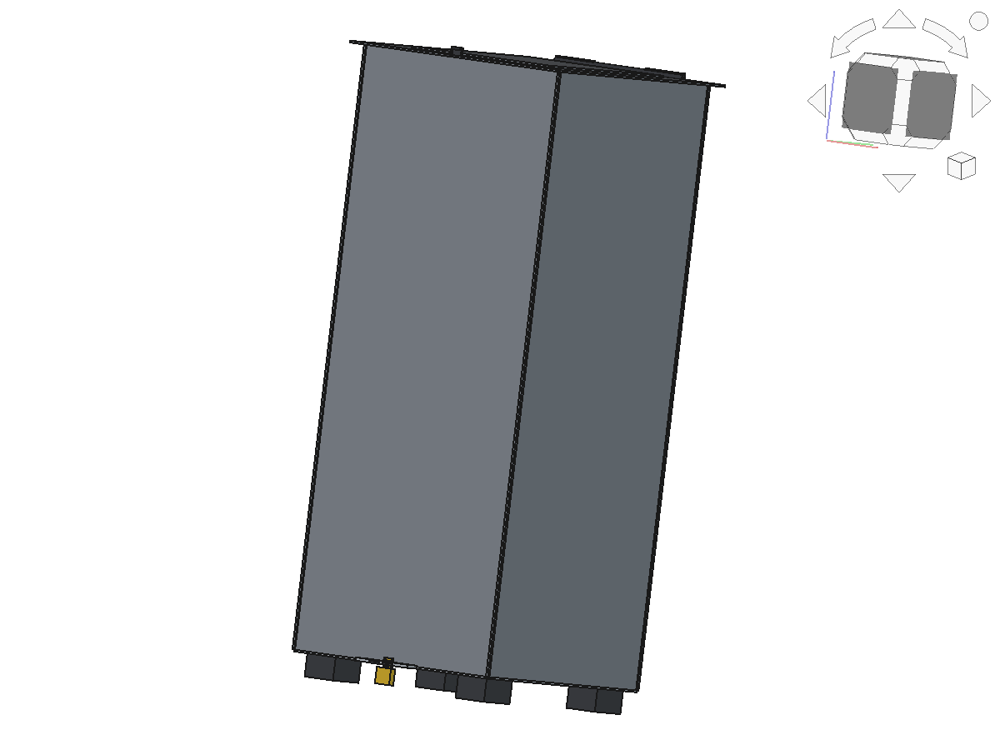
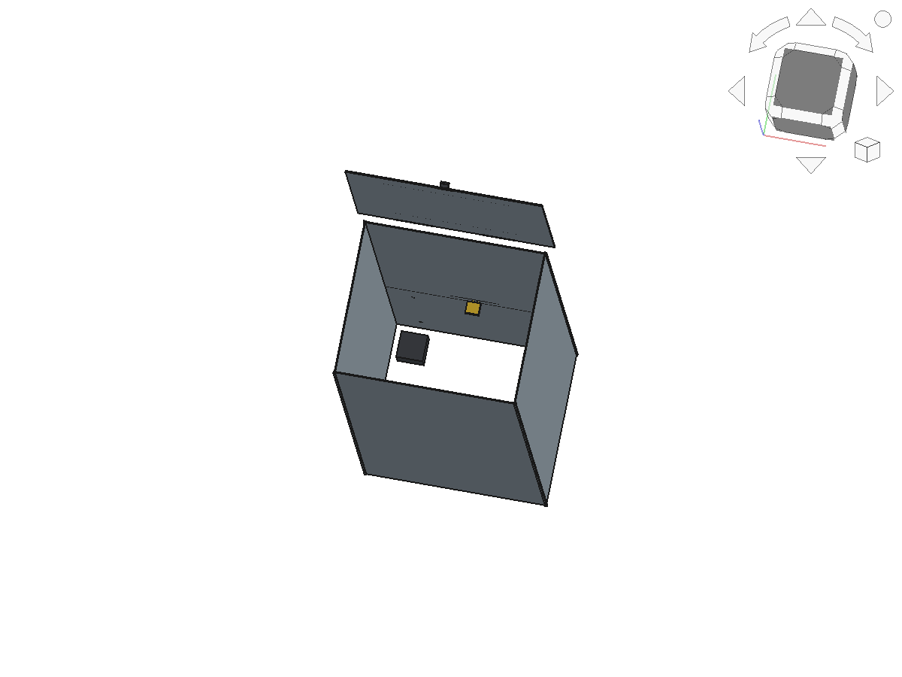
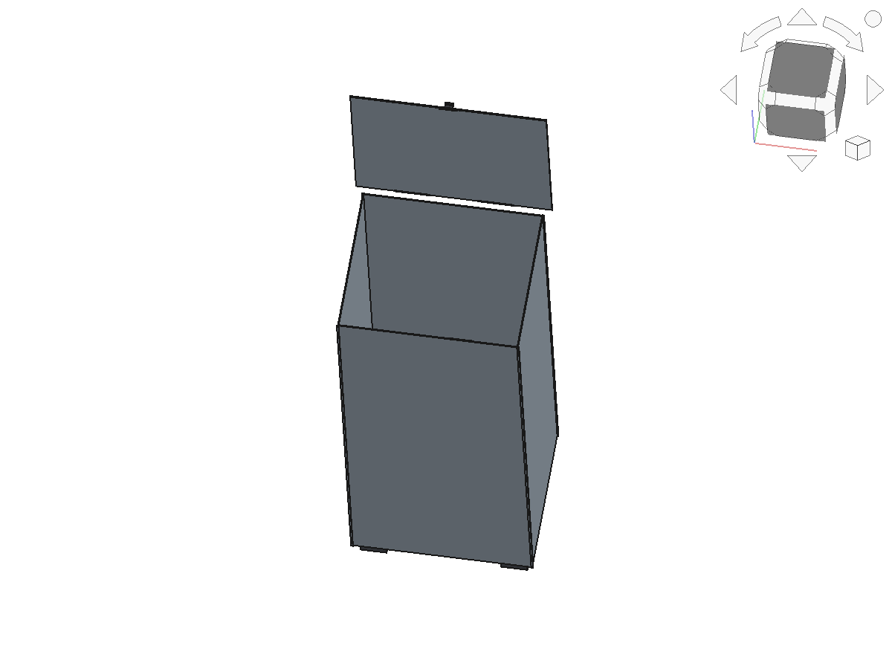
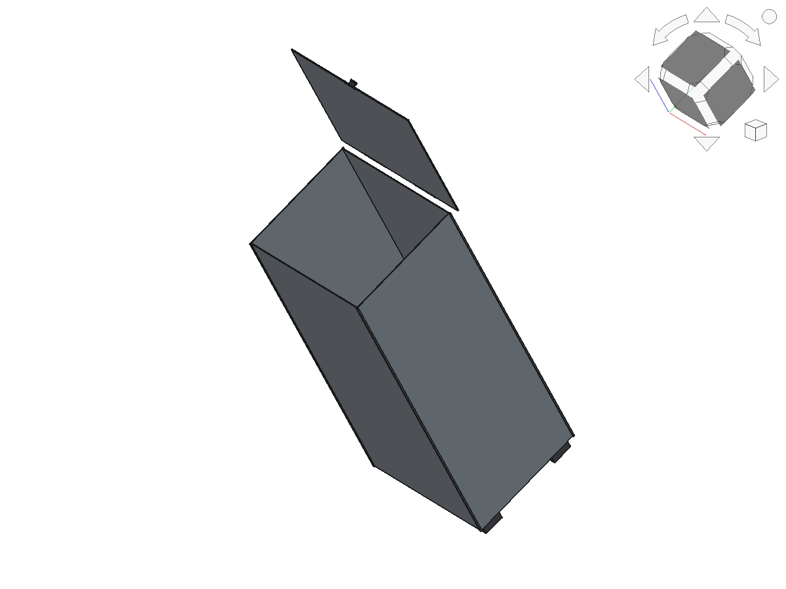

# Parcel Drop Box — Sheet-Metal Courier Delivery Box

A compact sheet-metal parcel box in the style of the 3FlexHome
"Large Parcel Drop Box — Top Access":

- **Hinged top flap (top access)** — couriers drop parcels in from above.
- **Lockable bottom door** — the owner retrieves parcels through a
  rear-hinged bottom door secured with a hasp + padlock.
- **Raised on 4 feet** — floor sits above ground, weatherproof.

Built parametrically in [FreeCAD](https://www.freecad.org).

## Dimensions

| Parameter | Value |
|-----------|-------|
| Outer width (X) | 410 mm |
| Outer depth (Y) | 350 mm |
| Overall height (Z) | 990 mm (950 body + 40 feet) |
| Steel sheet thickness | 2 mm |
| Top flap overhang | 18 mm (rain) |

## Parts

| Part | Role |
|------|------|
| `Feet` | 4 feet, lift the box off the ground |
| `Body` | 4 walls + top rim + corner ribs (open top & bottom) |
| `TopFlap` | Hinged top flap for courier drop-in (18 mm rain overhang) |
| `FlapHinge` / `FlapLatch` | Flap hinge (rear) + front drop latch |
| `BottomDoor` | Floor panel, hinged on the rear edge, pull handle + 4 drainage holes |
| `DoorHinge` | Bottom-door hinge (rear edge) |
| `Hasp` | Lock bracket on the front bottom edge |
| `Padlock` | Padlock that secures the bottom door |

## Files

- `cad/ParcelDropBox.FCStd` — FreeCAD document, closed state
- `cad/ParcelDropBox.step` — STEP export of all 9 parts
- `build_box.py` — parametric FreeCAD script (regenerates both states)
- `images/` — rendered views (closed + open)

## Views

Closed:

| Isometric | Front | Bottom | Right |
|-----------|-------|--------|-------|
|  |  |  |  |

Open (top flap + bottom door swung up):

| Isometric | Front | Back |
|-----------|-------|------|
|  |  |  |

## Regenerate

Run `build_box.py` inside FreeCAD (GUI Python console, or
`freecadcmd build_box.py`). It creates the `ParcelDropBox` (closed) and
`ParcelDropBoxOpen` (flap + door open) documents and exports the STEP file.

## Design notes

- Top access is a hinged flap (not a fully open top) so parcels stay
  dry; the flap has an 18 mm overhang and a front drop latch.
- The bottom door hinges on the **rear** edge and lifts up ~90°, so the
  hasp/padlock on the **front** edge stays clear while the door is open.
- The floor has 4 drainage holes so any water that gets in can escape.
- All solids verified: valid geometry, no structural overlap (feet butt
  against the floor underside); the only overlaps are the intentional
  hinge/hasp/padlock clamps.
